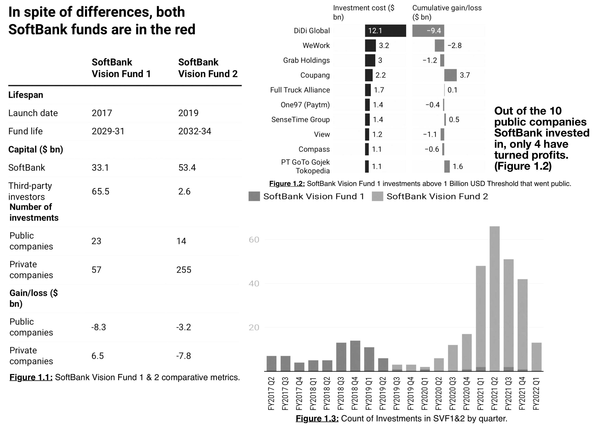
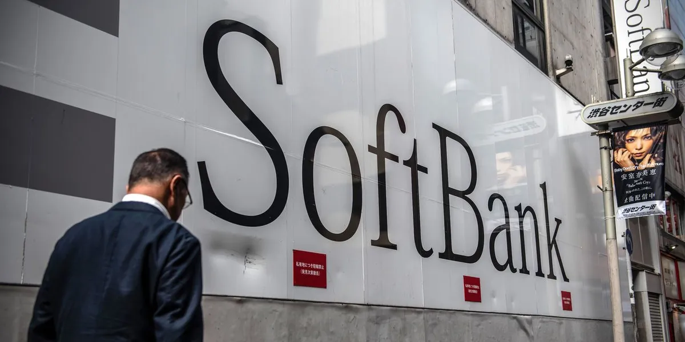

# Does the SoftBank Vision Fund need an eye doctor in 2022?
###### Moh Jaiswal, Research Analyst
---
## Who is SoftBank Vision Fund?
### One of the boldest riders in technology investing that specializes in growth capital and social impact investments has posted a $7.2 billion quarterly loss last week.
---
### What is SoftBank Vision Fund 1 and 2?    
The SoftBank Group subsidiary invests in internet-of-things, artificial 
intelligence (AI), robotics, communications infrastructure, telecoms, computational biology, biotech, cloud technologies and software, consumer e-commerce, fintechs, and apps. It aims to invest "in businesses and foundational platforms that SoftBank believes to revolutionize and innovate the world tomorrow." 

#### SoftBank Vision Fund 1 

The inaugural fund was launched in 2017 with SoftBank being an anchor investor alongside West Asia and tech giants like Apple also participating in a $100 billion corpus focused on cutting the big cheques and dominating with late-stage investing stratergies. This while being an aggresive stratergy for expansion, faced challenges with fund deployment and exiting investments.

#### SoftBank Vision Fund 2

Masayoshi Son, the head of the SoftBank group was eager to launch SVF 2 in 2019, two years after the inception of SVF 1. This time the fund was about 40% the size of SVF 1. The key differentiatior was in the concentration of investments, SVF2  was sparsely scattered at 3x the number of investments as compared to SVF1.

### Why this matters

Both the above funds are in the red. While the general aura of the public markets is bleak. Of the 349 companies invested between the two funds, 80% were downgraded in the previous quarter. Most of these were private companies, the market saw this as an error in overestimating performance and therefore valuations.

The myth of big checks meant big money was not one endorsed at SVF, the big cheques were cut under the agreement of mature valuations, the short term gains were shorter than sweeter, leaving SVF unproteced against market corrections in the longer run, the short term gains were not cushion enough to break the fall. 

## Results

Just looking at SVF 1, the elder more mature of the two is down about 26% on its investment cost of $32.5 billion. In 10 of these, SVF 1 invested at least $1 billion, including Indian company Paytm. As of June 2022, in just four of these 10 companies was SVF 1 in the money. And its loss in just one company, DiDi Global, exceeded the gains made ~~elsewhere~~ by the aformentioned 4.

Note: that SoftBank follows an April to March financial year (Figure 1.3)

## Why This May be Interesting

As they try to recover reputation and performance, the two SVFs need sentiment in public markets to look up. They have deployed their capital. They need investee companies to use this capital to deliver high rates of business growth and profits. And, at some point, they would want to monetize their investments. An essential outlet for that monetization is listing on the stock market, either through initial public offerings (IPOs) or by taking the special purpose acquisition companies (SPACS) route, where an investee company acquires a listed company.

Of the 42 public listings of SVF companies, 28 were IPOs and 14 were SPACs. Much of these happened in 2021. In 2022, however, public markets across the world have gone cold. Central banks, led by the American one, have tightened the flow of funds. In a simpler manner of speaking, the current atmosphere has triggered a multiple round injection of interest rate hikes. In the first six months of 2022, the number of IPOs in major markets are presently on course to trail the 2021 count by a big margin.

Size hasn't helped the SVF funds. Deploying a large corpus has meant the necessity to write big cheques. The unicorns these big cheques were written out for are now facing headwinds in this economy. Son plans on radical changes in not just their investment approach but personnel and cost structures.

## Resources

* [Good introduction to SVF parent Softbank Co.](https://www.barrons.com/articles/softbank-stock-has-rallied-why-the-shares-are-still-worth-buying-51598053230)

* [Up to Speed](https://www.barrons.com/articles/softbank-shares-slide-51668458167?mod=Searchresults)

## Legal Disclaimer: 

### This analysis is for educational and research purposes only. It is not intended to provide financial or investment advice. Please be cautious and conduct thorough research before making any investment decisions. The owner of this repository is not liable for any actions taken based on the information provided. The findings and conclusions in this repository should not be considered as a substitute for professional advice.

* [Crunchbase](https://www.crunchbase.com/organization/softbank-vision-fund/investor_financials)

* [Data source](https://howindialives.com)

* [Mint](https://www.livemint.com/companies/news/softbank-funds-have-a-long-road-to-redemption-11660664908477.html)

## Legal Disclaimer: 

### This analysis is for educational and research purposes only. It is not intended to provide financial or investment advice. Please be cautious and conduct thorough research before making any investment decisions. The owner of this repository is not liable for any actions taken based on the information provided. The findings and conclusions in this repository should not be considered as a substitute for professional advice.
